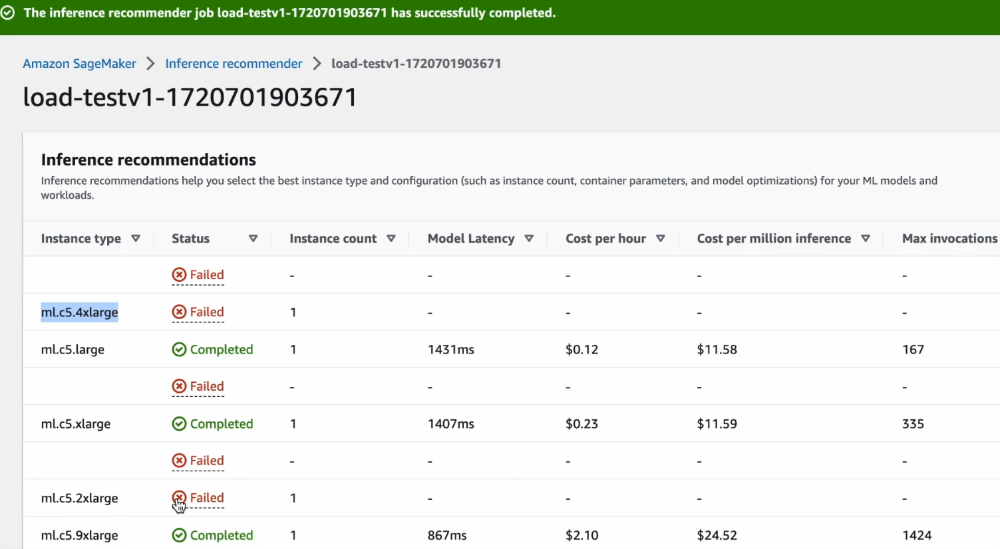
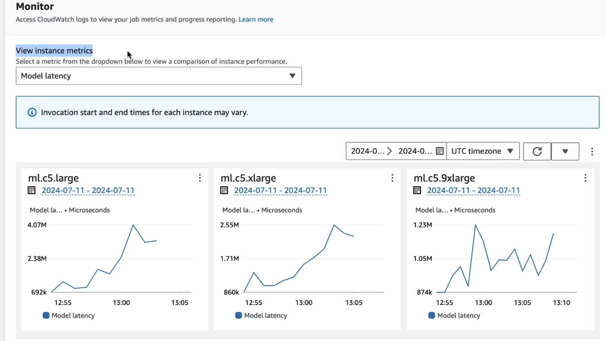
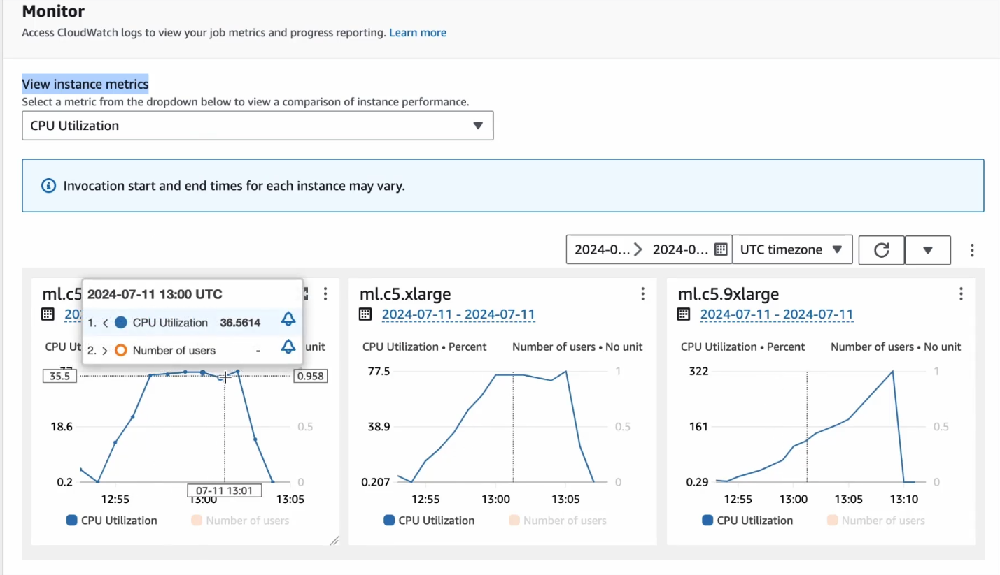

# Load Testing

The main purpose of this section is to get **Inference Recommendations**

## 1. What are Inference Recommendations ?

Inference recommendations help you select the best instance type and configuration (such as **instance count**, **constainer parameters**, **model optimizations**) for your ML models and workloads.


## 2. Create data for Load Testing

- The Idea is to get few json files , each one containing an input in the right format.
- These few inputs will be then used to send 1000s of inference requests to the model.
- zip all input files
- Each File content is like:
```json
    {
    "inputs":"Tesla Stock Bounces Back After Earnings"
    }
```
- The  [load-test.py](https://github.com/egafossojm/ml-text-classification-project/blob/main/4.LoadTesting/load-test.py) script will generate those input files and put them all  in `inputs.tar.gz`.
```bash
$ python3 load-test.py 
$
$ ls -al
total 28
drwxrwxr-x. 3 user user 151 Apr 18 19:16 .
drwxrwxr-x. 7 user user 111 Apr 17 11:48 ..
-rw-rw-r--. 1 user user  59 Apr 18 19:16 input1.json
-rw-rw-r--. 1 user user  53 Apr 18 19:16 input2.json
-rw-rw-r--. 1 user user  49 Apr 18 19:16 input3.json
-rw-rw-r--. 1 user user  53 Apr 18 19:16 input4.json
-rw-rw-r--. 1 user user 382 Apr 18 19:16 inputs.tar.gz
-rw-rw-r--. 1 user user 849 Apr 18 19:15 load-test.py
```

- We will then upload `inputs.tar.gz` file to our S3 bucket, in the **load-test** folder.

### 3. Prepare Our Load Test

>[!NOTE]
>
>Each time you deploy a Model Endpoint in SageMaker, a corresponding Model is created.\
>Even if you delete the Endpoint, the model remains.\
>We don't need the endpoint for the load test, juste the model.
> - view the model Endpoint at `Amazon SageMaker AI > Deployments & Inference > Enpoints`
> - View its corresonding model at  `Amazon SageMaker AI > Model governance > Model dashboard`

>[!TIP]
>
>It could be difficult to identify an endpoint and its corresponding model if there are plenty.
>It's a good practice to name the model as well as its EndPoint.
>```python
>huggingface_model = HuggingFaceModel(
>    model_data = model_s3_path,
>   role = role,
>    transformers_version = "4.6",
>    pytorch_version = "1.7",
>    py_version = "py36",
>    entry_point = "inference.py"
>    name = "load-testing-model"
>)
>
>predictor = huggingface_model.deploy(
>    initial_instance_count = 1,
>    instance_type = "ml.m5.xlarge",
>    endpoint_name = "multiclass-text-classification-load-test-endpoint"
>)
>```

### 4. Start our Load Test Job

- Go to  `Amazon SageMaker AI > Deployments & Inference > Inference Recommender`
- ` Create job`
- **Job Type**: `Default recommender job`
- **Model**: Find the Model named `load-testing-model`
- **IAM Role**: The role should have access to the Input data in S3, added to sagemeker permissions.
- **S3 bucket for benchmarking payload**: This must be a gzip compressed tar archive (The `inputs.tar.gz` URI).
- **Payload content type**: `application/json` or `text/csv` depending on the input type.
- **Next**, select the instance types you want to test(up to 8). If you select less that 8, Sagemaker will randomly complete the list to reach 8 instance types.
- **Next**, try some optional `job parameters`.
- **Submit**

### 5. Load Test results

Once complete, Go to `Amazon SageMaker AI > Deployments & Inference > Inference Recommender` and select your load test.

**Inference recommendations** section help you select the best instance type and configuration(instance count, container parameter, model optimizations) for your ML models and workloads.


**Monitor** section Access CloudWatch logs to view your job metrics and progess reporting.

**Model Latency**


**CPU**

