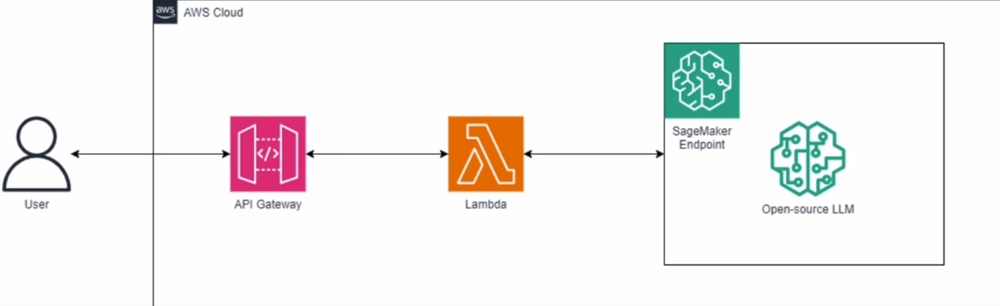
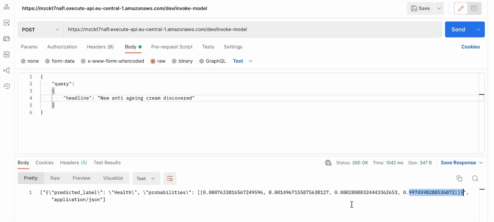

# Final Step: Deploy the model for production

### 1. Architecture

### 2. Deploy an endpoint for our model
See [Deployment](https://github.com/egafossojm/ml-text-classification-project/tree/main/3.Deployment) section.

### 3. Create a lambda function

- Make sure the function has permissions to access SageMaker
- Deploy the [aws-lambda-llm-endpoint-invoke-function.py](https://github.com/egafossojm/ml-text-classification-project/blob/main/5.ProductionGradeDeployment/aws-lambda-llm-endpoint-invoke-function.py) lambda function.
>[!NOTE] 
>
> Replace the placeholder with your endpoint.

- Test the function  with the direct **headline** commented in the code

### 4. Set up an API Endpoint

In the API Gateway console;

- `Build` a HTTP API
- Give the API Name, review and create
- Create a POST route and name it **/invoke-model**.
- (Oprional) Create an Authorization that will be attached to the route
- Create a Lambda integration (select our lambda function)
- Attach the lambda integration to our route
- create a **dev** stage
- deploy our API to the dev stage for test.

### 5. Test the API gateway with Postman

We will be using [Postman](https://www.postman.com/) (A great tool that allows you to test a backend without having to build  a frontend).\
Befor you create a React or Angular application, you can test if your backend (which is the core business part) actually works.

Send a POST request to the API endpoint:

